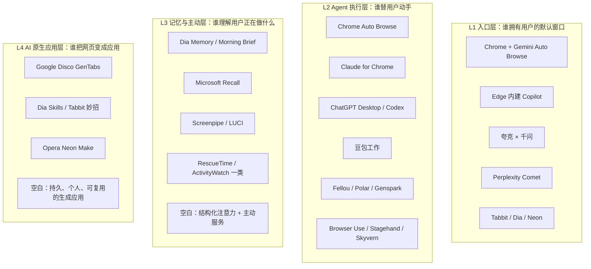
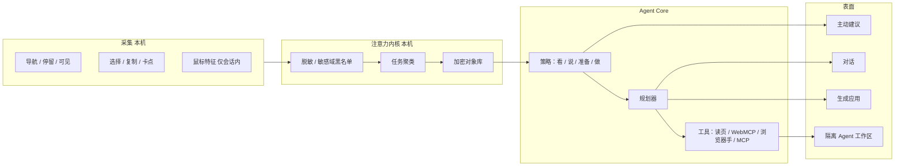

# Agent Core 浏览器：市场调研与产品方案（第一轮）

> 日期：2026-09-07  
> 状态：讨论稿，用来对齐产品形态，不是最终规格  
> 仓库定位：`ai-browser` / browser with agent core

本文是第一轮。目标不是马上定死功能清单，而是把市场上已经发生的事摊开，指出真正还空着的位置，并给出几条可选择的产品形态。你们提到的「记录鼠标、停留、网址时间，做主动性 Agent 和 AI 原生应用」，会在第 4–6 节单独拆开。

---

## 0. 先说判断

2026 年的 AI 浏览器已经不是蓝海。

- **「侧边栏能聊天、能摘要」已经商品化。** Chrome Gemini、Edge Copilot、Brave Leo、夸克 × 千问、豆包，都在做这件事。
- **「Agent 替你点网页」正在被巨头吃掉。** Chrome Auto Browse 已经进桌面和 Android；Claude / ChatGPT 都以扩展或桌面应用形态接管浏览器操作；国内 Tabbit、豆包工作也在做执行。
- **独立「ChatGPT 套一层 Chromium」已经被证伪。** OpenAI 的 ChatGPT Atlas 在 2026-08-09 关停，能力并回 ChatGPT 桌面端和 Chrome 扩展。OpenAI 自己也关过 Operator。结论不是「Agent 浏览没人要」，而是 **浏览器壳本身不是护城河，分发和日常使用频率才是**。
- **真正还没被做好的，正好靠近你们的直觉：**  
  不是再做一个会点网页的浏览器，而是做一个 **能理解用户正在做什么、只在该出现时出现、并把正在进行的事变成可运行应用** 的 Agent Core。

一句话定位建议：

> 这不是「带 AI 的 Chrome」，而是一台装在浏览器里的个人操作系统：  
> **观察注意力 → 形成任务记忆 → 主动准备 → 受控执行 → 生成应用。**

鼠标轨迹、停留时长不该是产品本身，它们只是 **注意力内核** 的原始信号。

---

## 1. 赛道其实有四层，不要和所有人打架

把「AI 浏览器」当成一个品类，会误判对手。市面上至少四层，彼此重叠，但赢法完全不同。



| 层 | 用户真正买的是什么 | 2026 年格局 | 小团队硬刚的结果 |
|---|---|---|---|
| L1 入口 | 默认浏览器、书签、密码、扩展、同步 | Chrome / Edge / 夸克垄断分发；Comet 是唯一完整移动端 AI 原生浏览器 | 极难。Atlas 已证明 |
| L2 执行 | 替我点、填、比、买 | 巨头 + 开源框架同时涌入，可靠性仍差 | 可做差异，但不要把「点得更准」当唯一卖点 |
| L3 记忆 / 主动 | 懂我在干什么，提前提醒、准备、衔接 | Rewind 已死；Recall 争议大；Dia 只做工作上下文；几乎没人做好「行为 → 意图」 | **最适合你们切入** |
| L4 生成应用 | 把一堆标签变成一个工具 | 只有 Disco 在认真实验，且是临时、实验、Mac 候补 | **中期差异化，和 L3 组合成完整故事** |

你们现在的想法（记录使用 / 鼠标 / 停留，做主动 Agent 和 AI 原生应用）跨的是 **L3 + L4**，浏览器只是载体。这是对的。如果一上来把全部精力花在「做一个比 Chrome 更好用的日常浏览器」，会变成和分发打仗。

---

## 2. 市面产品全景

调研截止 2026-09。价格和平台变化很快，下面按 **产品哲学** 分组，而不是按功能打勾。

### 2.1 巨头：把 AI 焊进已有入口

| 产品 | 公司 | 形态 | 核心命题 | 对你们的含义 |
|---|---|---|---|---|
| Chrome + Gemini Auto Browse | Google | 已有浏览器 + OS 级能力 | 3 亿用户不用换浏览器，Agent 直接点网页；Android 还要做到系统级 | 执行层会被免费化。不要和 Chrome 比「谁更能点」 |
| Google Disco / GenTabs | Google Labs | 实验浏览器 | 根据打开的标签和对话，**生成一次性 Web 应用**（行程规划器、学习面板） | 最接近「AI 原生应用」。但只看当前标签，不做长期个人记忆 |
| Edge 内建 AI | Microsoft | 已有浏览器 | Copilot Mode 品牌已取消，AI 变成 Edge 默认姿态 | Windows 默认盘被占住 |
| Microsoft Recall | Microsoft | 系统记忆 | 每隔几秒截屏，做可搜索的视觉时间线 | 证明「记录一切」有需求，也证明隐私做不好会翻车 |
| Claude for Chrome | Anthropic | 扩展 | 不换浏览器，给现有 Chrome 一双手；强调权限和确认 | OpenAI 关 Atlas 后也走了这条路：扩展 + 桌面应用 > 独立浏览器 |
| ChatGPT Atlas → Desktop | OpenAI | 已关停独立浏览器 | 2025-10 上线，2026-08-09 关停；能力并入 ChatGPT 桌面端 / Chrome 扩展 / Codex | **独立浏览器如果只是模型的壳，活不下来** |
| Safari / Firefox | Apple / Mozilla | 克制 | 2026 才出第一批有护栏的 Agent 能力；Vivaldi 仍反 AI | 隐私用户还在，但这不是大众市场 |

Google 还做了两件基础设施的事，会改变整个行业：

- **WebMCP** 已进 Chrome 源试用：网站可以向 Agent 暴露结构化工具，而不是让模型瞎点 DOM。
- **Google-Agent** User-Agent：网站开始能区分「人在看」和「Agent 在替人看」。

中期含义：网页会分化成「给人看的 UI」和「给 Agent 调的 API」。你们的 Agent Core 必须同时吃两套接口。

### 2.2 独立 AI 原生浏览器

| 产品 | 公司 | 核心命题 | 强项 | 弱项 / 风险 |
|---|---|---|---|---|
| Perplexity Comet | Perplexity | 浏览器 = 带出处的答案引擎，附带 Agent | 研究综合、引用、跨平台（Mac/Win/iOS/Android）、已免费 | 提示词注入（CometJacking）出过事；和 Amazon 有诉讼；日常标签体验一般 |
| Dia | The Browser Company → Atlassian | 浏览器 = 知识工作者的同事 | 和标签聊天、Skills、Morning Brief、接 Slack/Notion/GSuite；记忆按标签/技能收束；设计克制 | 基本只在 Apple 芯片 Mac；Agent 故意不做满自治；已被企业化 |
| Tabbit | 美团光年之外 | 浏览器 = 可执行的工作台 | 独立标签组里跑 Agent、`@` 显式引用上下文、妙招 Skills、多模型、垂直标签 | 无移动端；公开对比文章由自己写，需打折看；执行可靠性仍是行业通病 |
| Opera Neon | Opera | 付费、多 Agent 并行 | Do / Make / 研究 / 聊天四类 Agent，Intelligent Mode 自动路由，支持 MCP | $19.90/月，品牌拉力弱 |
| Fellou | Fellou | 透明的计划-执行 Agent | 先出可编辑计划再跑；Deep Action / Deep Search；能进已登录站点 | 要人盯着；安全面大 |
| Polar | Recursive Intelligence | 超长任务的知识工作 Agent | 号称可跑十几小时，多 Agent 编排，学用户 | 新品，场景偏销售研究/招聘流水线，不是日常浏览器 |
| Genspark | Genspark | 端侧模型商店 + Autopilot | 本地模型、打电话/订位等 Super Agent、MCP Store | 安全评估不乐观 |
| BrowserOS | 开源 | 可自带模型的 Chromium | 开源、Ollama / 自带 Key、Agent Mode | 体验和分发都还是极客产品 |
| Sigma AI Browser | Sigma | 免费、本地、全平台 Agent | 低门槛试玩 | 品牌和完成度有限 |
| Samsung Browser | 三星 + Perplexity | OEM 浏览器跨端 | 手机和 Windows 会话同步 | 区域有限 |

### 2.3 中国市场：入口战争，不是 Agent Core 战争

| 产品 | 实际在卖什么 | 和「Agent Core 浏览器」的距离 |
|---|---|---|
| 夸克 AI 浏览器 × 千问 | 系统级唤起：读屏、快捷框、侧边栏、悬浮球、划词、截屏。宣称 PC 安装量约 1.1 亿 | 赢在入口和唤起，不赢在任务记忆和生成应用 |
| 豆包 / 豆包工作 | 从聊天走向「会干活」：本地电脑 + 云电脑、技能、连接器、飞书企业上下文 | 更像办公 Agent OS，浏览器只是它的一只手 |
| Tabbit | 见上，国内目前最接近「AI 原生浏览器」的独立产品 | 直接竞品，但主动记忆层很浅 |
| 纳米 AI 搜索 / 秘塔 / 天工 | 搜索和垂直研究 | 不是浏览器 |
| QQ 浏览器等 | 传统入口 + AI 插件 | 跟随者 |

国内用户已经习惯「一个超级 App / 一个助手解决所有事」。如果你们做 C 端，要准备好和豆包、夸克抢心智；如果做生产力人群，Tabbit 和 Dia 才是对标。

### 2.4 记忆 / 记录类：和你们最像，也最能当反面教材

| 产品 | 记什么 | 现状 | 教训 |
|---|---|---|---|
| Microsoft Recall | 屏幕截图时间线 | Copilot+ PC，默认选择加入，本地加密 | 「什么都拍」会引发监管和舆论；截图比结构化事件更重、更危险 |
| Rewind → Limitless | 屏幕 + 音频 | Meta 收购后，2025-12 停录，产品死亡 | 连续录屏公司很难独立活下来；数据一旦离开用户设备，信任破产 |
| Screenpipe | 本地屏幕 / 音频，给 Agent 当记忆 API | 还在做，偏开发者 | 方向对：记忆应是 Agent 的基础设施，不是一个回放 App |
| LUCI 等 Recall 替代 | 本地屏幕 + 会议 | 小品类 | 证明需求在，产品没形成新交互 |
| RescueTime / Timing / ActivityWatch | 应用和网站停留 | 老品类 | 只有统计，没有意图，更没有行动 |
| NeoFlo 一类实验 | 结构化浏览事件（导航、点击、滚动、空闲），不截屏 | 早期开源 | **事件模型比录屏更接近你们该做的** |
| Hotjar / Clarity / FullStory | 鼠标热力、rage click | 给网站主看访客，不是给用户自己用 | 说明鼠标信号有价值，但那是分析师视角，直接搬到个人产品会很恐怖 |

### 2.5 开发者基础设施（你们会用到，但不是对手）

| 层 | 代表 | 用途 |
|---|---|---|
| Agent 库 | Browser Use、Stagehand、Skyvern | 感知-决策-点击循环 |
| 协议 | Playwright MCP、WebMCP、MCP | 把浏览器能力接到任意模型 |
| 云浏览器 | Browserbase、Steel、Hyperbrowser、Cloudflare Browser Run | 无头、隐身、回放、并发 |
| 计算机使用 API | Claude Computer Use、Gemini Computer Use、Amazon Nova Act | 看屏幕点鼠标的模型能力 |

这些东西 12 个月内会继续变便宜。你们的壁垒不该是「我们会自动点网页」，而该是 **点之前就已经知道该点什么、为什么点、点完之后沉淀成什么**。

---

## 3. 竞品地图：他们占领了哪句话

```text
                    被动辅助                         主动行动
                       │                                │
     聊天 / 摘要        │         代操作 / 工作流           │
                       │                                │
  高隐私  ─ Brave Leo   │   Dia（克制 Skills）            │
           夸克套件     │   Tabbit / Comet / Neon        │
                       │   Claude / ChatGPT 扩展        │
                       │   豆包工作                      │
                       │                                │
  低隐私  ─ Chrome 侧栏 │   Chrome Auto Browse           │
                       │   Fellou / Polar / Genspark    │
                       │                                │
  ─────────────────────────────────────────────────────
                       │
               记录过去的我                      生成新界面
                       │
           Recall / Screenpipe          Disco GenTabs
           Dia Morning Brief            Neon Make
           时间统计 App                 （几乎没人做成个人 OS）
                       │
               ★ 你们最该站的交叉点
          观察 → 意图 → 主动准备 → 生成应用
```

绝大多数产品只占四个象限中的一个。  
**同时做「懂你」和「长出应用」的，今天没有成熟产品。** Disco 会生成应用，但不懂你的长期行为；Recall 记得你看过什么，但不能行动；Comet / Tabbit 能行动，但基本上你不叫它，它就在睡觉。

---

## 4. 对你们现有想法的分析

你们现在的直觉可以拆成三句话：

1. 主动记录使用、鼠标、网址停留。
2. 基于这些信号做主动性服务。
3. 浏览器要是 AI 原生应用的容器，而不只是网页查看器。

三句话里，**2 和 3 是产品，1 是手段。** 第一轮最容易走偏的地方，就是把手段当成产品。

### 4.1 哪些信号真的有用

| 信号 | 能推断什么 | 该不该存原始数据 | 建议 |
|---|---|---|---|
| 网址 + 停留 + 可见时间 | 正在研究什么、卡在哪一页 | 域名 / 路径级，是；完整 URL 带 query 要脱敏 | **核心信号** |
| 标签切换、复访、来回跳 | 任务在哪些站点之间切换 | 要 | 用来切「任务对象」 |
| 滚动深度 / 速度 | 在读，还是在扫 | 聚合特征即可 | 区分精读 vs 检索 |
| 划词、复制、保存、分享 | 哪些片段被当成知识 | 片段级，要用户可见 | 高价值 |
| 表单停顿、反复聚焦、rage click | 卡住了，可以主动帮忙 | 只存「卡住」事件，不存输入 | 主动服务的最佳触发 |
| 搜索词、站内搜索 | 显式意图 | 要，需敏感词过滤 | 比鼠标更干净 |
| 鼠标轨迹、速度、加速度 | 阅读路径、犹豫、生物特征 | **不要长期存原始坐标** | 只在会话内算特征，立刻丢掉轨迹 |
| 键盘 | 几乎全是隐私 | 默认不记内容 | 只记「有输入 / 无输入」 |
| 屏幕截图 | 最全，也最危险 | 默认关 | 用户主动「记住这一刻」再拍 |

关键结论：

> 不要做「个人版 Hotjar」。  
> 要做「注意力图谱」：把原始外设事件，在本机收成 **任务、实体、卡点、习惯** 四级对象。

鼠标不是产品卖点，也很难对外讲。对外能讲的是：

- 「你这周第三次打开这家的定价页，要不要生成对比表？」
- 「这个表单你停了 40 秒，要我填吗？」
- 「你今天下午一直在三个招聘站和一份 JD 之间跳，要不要生成一个候选人看板？」

用户买的是后三句，不是「我们记录了鼠标」。

### 4.2 主动服务的正确姿势

市面上的「主动」大多是假主动：

- Dia Morning Brief：其实是日历 + 邮箱的定时摘要。
- Chrome / 夸克：你不叫，它不来。
- Recall：你事后去搜。

真主动有四级，建议默认停在 2，用户升级到 3，4 永远要确认。

| 级别 | 行为 | 例子 | 风险 |
|---|---|---|---|
| 0 静默记忆 | 只记，不说话 | 形成「日本旅行」任务对象 | 低 |
| 1 可发现 | 在侧栏出现一条浅提示 | 「持续研究中的 3 个主题」 | 低 |
| 2 适时建议 | 在卡点或节奏点出现 | 表单犹豫、离开页面前、早晨第一开 | 中，要控频 |
| 3 准备但不提交 | Agent 在隔离工作区起草 | 比价表、邮件草稿、行程 App | 中 |
| 4 代执行 | 真的点击、提交、下单、发信 | 订票、群发、改线上数据 | 高，必须人确认 |

Atlas / Operator / Comet 的翻车，很多发生在第 4 级：点了钓鱼站、买了假货、被提示词注入。  
**主动产品的护城河在 0–3 级。** 第 4 级让巨头去烧钱，你们做成「准备好了，你按一下」。

### 4.3 AI 原生应用该长什么样

不要理解成「浏览器里再嵌一个 ChatGPT」。更接近 Disco 的 GenTabs，但要补上 Disco 没有的三件事：

1. **持久**：不是这次标签关了应用就消失。
2. **个人**：应用绑定你的任务记忆，而不是通用模板。
3. **可行动**：应用里的按钮可以唤起受控 Agent，而不是死数据面板。

四个应用原型（用来讨论，不是第一版全做）：

| 应用 | 由什么观察触发 | 生成出来的东西 | 和普通网页的差别 |
|---|---|---|---|
| 研究工作台 | 多站点复访 + 复制 + 长停留 | 来源墙、争议点、待读、引用草稿 | 它记得你已经看过什么 |
| 决策卡 | 反复打开定价 / SKU / 方案页 | 对比表、未决问题、风险 | 它知道你卡在「选」而不是「搜」 |
| 流程板 | 同一表单或后台来回操作 | 步骤清单、已填字段、下一步按钮 | 把网站当 API，界面是你们的 |
| 生活项目 | 旅行 / 装修 / 求职等跨天主题 | 时间线、预算、材料包 | 浏览器变成这个项目的 OS |

这就是「AI 原生」：网页是原料，应用是产物，Agent 是运行时。

---

## 5. 产品形态：四条路，第一轮必须先选路

独立浏览器、扩展、桌面 Agent、记忆层，四条路的成本和死法不一样。

### 路线 A. 完整 Chromium 独立浏览器

**像：** Comet、Dia、Tabbit、Neon、BrowserOS

- 好处：能改标签、工作区、地址栏、默认搜索、Agent 隔离标签组；品牌完整。
- 坏处：安全补丁、扩展兼容、密码同步、PDF、打印、WebRTC，全是脏活。Atlas 死在「用户不愿为了 AI 换默认浏览器」。
- 适用：你们决心做品牌，且能在 6 个月内达到「日常能当默认浏览器」的素质。

### 路线 B. 扩展 + 本机守护进程（建议作为第一期验证）

**像：** Claude for Chrome、Manus Browser Operator、NeoFlo、Screenpipe 的浏览器部分

- 好处：用户不用换 Chrome / Edge；能最快验证「观察 → 主动建议」是否被接受。
- 坏处：扩展 API 能看到的比浏览器内核少；主动 UI 只能做侧栏、气泡、独立窗口。
- 适用：先验证 L3，再决定要不要养一个浏览器。

### 路线 C. 桌面 Agent OS，浏览器只是其中一只手

**像：** ChatGPT 桌面端、豆包工作、Claude Computer Use

- 好处：可以碰本地文件、日历、其他应用；叙事是「工作系统」不是「又一个浏览器」。
- 坏处：品类变成和豆包、ChatGPT 抢；浏览器体验容易做浅。
- 适用：目标用户是重度知识工作者，浏览器只是工作流的一部分。

### 路线 D. 混合：内核先做「浏览器内 OS」，外壳先挂在 Chrome 上

这是我建议讨论的默认路径。

1. **现在：** Chrome/Edge 扩展 + 本地加密的注意力内核 + 主动建议 + 一个「任务 / 应用」侧舱。
2. **证明三件事之后：** 再 fork Chromium。  
   - 用户愿意让你们观察（隐私话术过关）  
   - 主动建议的点击率不是噪声  
   - 生成应用被反复打开，而不只是玩一次
3. **独立浏览器要赢的点：** 不是更炫的 Agent 演示，而是  
   **人的浏览、Agent 的浏览、生成应用，三种表面共享同一份任务记忆。**

独立浏览器可以是终局，但不该是第一天的形态。除非你们已经决定「我们就是要做浏览器公司」，那就把日常浏览器素质（导入、垂直标签、工作区、广告拦截）提到和 Agent 同等优先级——Dia / Arc / Tabbit 都证明，标签体验是迁移扳机。

---

## 6. 推荐的北极星产品

名字先用工作名：**Agent Core**。对外一句话：

> 它看着你工作的方式，而不是看着你的屏幕。  
> 它很少说话。一旦开口，就是已经帮你准备好的下一步，或已经长好的一个小应用。

### 6.1 三个核心对象

不要以「聊天记录」为中心，以这三个对象为中心：

1. **Attention Event（本机、可销毁）**  
   停留、可见、滚动、选择、复制、复访、卡点。原始鼠标坐标不落盘。
2. **Task Object（用户能看见、能改、能删）**  
   「日本旅行」「竞品定价」「Q3 方案」。由事件聚类提出，用户确认后才成为一等公民。
3. **Surface App（可打开的 AI 原生应用）**  
   挂在某个 Task 下，能读这份记忆，能唤起受控 Agent。

聊天只是这三者的调试台，不是首页。

### 6.2 用户一天会碰到的五次接触

| 时刻 | 产品做什么 | 用户感觉 |
|---|---|---|
| 早上第一次打开 | 基于昨天未完成 Task，给 3 条以内的 Brief | 像一个懂分寸的同事，不是信息流 |
| 浏览中卡住 | 表单停顿 / 反复比价时，出现一条可关掉的建议 | 「它看见我卡住了」 |
| 用户召唤 | `@任务` 或划词，进入对话或生成应用 | 和 Dia / Tabbit 同类，但上下文是任务不是标签 |
| 离开一组相关页 | 「要把这次研究收成工作台吗？」 | 把标签爆炸收成一个 App |
| Agent 执行 | 默认在隔离档案 / 隔离标签组，步骤可见，提交要确认 | 能盯着，能抢方向盘 |

### 6.3 主动服务的三条产品原则

1. **观察默认开，上传默认关，执行默认问。**  
2. **一天主动开口有预算。** 例如免费用户 5 次，超过就沉到「可发现」而不再弹。  
3. **每条主动建议必须能回答：基于你看见的哪三件事？** 用户一点就能看到证据，一点就能「这类别永远别烦我」。

做不到这三条，记录行为就会被理解成监视。

### 6.4 和现有产品的差异化一句话

| 对手 | 他们是 | 我们是 |
|---|---|---|
| Chrome / 夸克 | 入口 + 唤起 | 不是入口战争 |
| Comet | 答案引擎 | 不是搜索公司 |
| Tabbit / Neon / Fellou | 你下令，它去点 | 你还没下令，它已经在准备 |
| Dia | 工作软件的上下文同事 | 行为上下文同事，不绑 Atlassian |
| Disco | 这次标签生成一次应用 | 跨天任务生成持久应用 |
| Recall / Rewind | 把过去变成可搜索录像 | 把过去变成可行动的对象 |

---

## 7. 能力架构（给后续技术讨论用）



分层原则：

- **采集层** 可先用扩展完成，不必等自己的 Chromium。
- **内核** 必须本地、加密、可导出、可一键粉碎。这是信任产品，不是云同步产品。
- **Agent Core** 要模型无关。Tabbit 的多模型、BrowserOS 的自带 Key，都说明用户不想被锁死。国内还要能切 DeepSeek / 千问 / Kimi / 豆包。
- **执行层** 复用 Browser Use / Stagehand / Playwright MCP，自研价值低。
- **应用层** 是沙箱：生成的是受限 Web App，只能读对应 Task 的记忆，只能调用白名单工具。

安全默认（直接抄行业血泪，不要重踩）：

- 银行、密码管理器、支付页：采集降级，Agent 禁入，或只读不写。
- 写操作（发信、下单、删除、转账）逐步确认。
- Agent 看网页前先剥 URL 和页面里的指令，防提示词注入。
- Agent 跑在独立 Cookie 空间，除非用户明确「用我已登录的这个站」。
- 不把浏览记忆默认用于训练。

---

## 8. 建议的推进节奏（仍可推翻）

这不是排期承诺，是为了让下一轮讨论有具体物。

### 第一期：只证明「被观察是可接受的，主动是有用的」

做一个很窄的东西：

- Chrome 扩展 + 本地内核
- 只采集：域名停留、复访、复制、卡点（不做原始鼠标落盘）
- 自动提出 1–3 个 Task，用户可改名、合并、删除
- 只有两种主动：  
  - 卡点气泡：「要我帮你填 / 对比 / 总结吗？」  
  - 离开时：「收成一个研究工作台？」
- 生成应用只做一种：**研究工作台**（来源、摘录、未决问题）

成功标准（比下载量重要）：

- 7 日留存的人里，>30% 至少点过一次主动建议
- 被关掉的建议里，>50% 用户愿意说「以后别这类型」而不是直接卸扩展
- 生成的工作台第二天还会被打开

失败就停，不要去 fork Chromium。

### 第二期：Agent 是手，不是脸

- 隔离工作区执行「准备级」任务：对比、摘录、草稿
- Skills / 妙招：用户确认过的流程可以再跑
- 策略引擎上线（看 / 说 / 准备 / 做）

### 第三期：如果第一期成立，再做独立浏览器

- Chromium 外壳
- 人、Agent、生成应用三种表面
- 垂直标签 / 工作区（迁移扳机）
- 多模型
- 可选的端侧小模型做任务聚类，减少云端暴露

---

## 9. 明确不做的事（第一轮就该写死）

1. **不做云端「人生回放」。** Rewind 和 Recall 已经把这条路的社会成本标出来了。
2. **不把原始鼠标轨迹当功能宣传。** 对外讲意图，对内用特征。
3. **不做无人监督的购物 / 支付 / 社交发布。** 让巨头去背诉讼和钓鱼。
4. **不和 Chrome 比扩展数量、和夸克比安装量。**
5. **不把聊天框当首页。** 那是 2023 年的 AI 产品。
6. **不默认同步明文历史到服务器。** 同步如果有，也只能是用户密钥加密的对象，而不是日志。

---

## 10. 风险

| 风险 | 为什么严重 | 怎么处理 |
|---|---|---|
| 隐私叙事失败 | 记录行为天生像监视 | 本地默认、证据可点开、敏感域黑名单、一天开口预算 |
| 主动变成骚扰 | 通知是产品里最容易被恨的部分 | 频控、类型级关闭、沉默时段 |
| 提示词注入 | Comet / Neon / Fellou / Atlas 都中过 | 最小工具面、写操作确认、页面指令剥离 |
| 法律与平台 | Amazon 诉 Perplexity；Agent 访问已登录站有 ToS 问题 | 默认用隔离档案；已登录执行需显式授权 |
| 换浏览器失败 | Atlas 已死 | 先扩展后浏览器 |
| 执行不可靠 | 社区共识：Agent 经常做到一半死掉 | 第一期不靠执行留存，靠记忆和应用 |
| 巨头抄 | Google 可以把 Disco + Recall 思路并进 Chrome | 分开采集和云，做成「只属于你的内核」；巨头做不到真本地 |

---

## 11. 下一轮请直接拍板的问题

请按题号回。不用一次答完，但 1–4 会决定方案第二稿怎么写。

1. **用户是谁？**  
   A. 个人生产力（研究者、运营、顾问、独立开发）  
   B. 团队知识工作者（对标 Dia × Atlassian）  
   C. 国内大众 C 端（对标夸克 / 豆包）  
   D. 先自己用，再找同类

2. **终局形态？**  
   A. 独立浏览器  
   B. 扩展 + 本地内核（长期都可以不换浏览器）  
   C. 桌面 Agent OS  
   D. 按第 5 节路线 D：先 B 后 A

3. **主动做到哪一级？**  
   只做到「建议 + 准备」，还是第一天就要「能代填、代点」？

4. **记录做到哪一级？**  
   A. 只要网址停留 / 复访 / 复制（我建议的默认）  
   B. 加上卡点、滚动、表单犹豫  
   C. 还要原始鼠标 / 点击热力  
   D. 还要可选截屏（Recall 路线）

5. **AI 原生应用的第一刀？**  
   研究工作台 / 决策对比卡 / 流程板 / 生活项目，选一个。

6. **模型策略？**  
   自带一个模型，还是用户自带 Key + 国内多模型？

7. **市场？**  
   先中文、先英文，还是两边同一套内核、两套外壳？

---

## 12. 第一轮结论

- 市面上「AI 浏览器」已经拥挤，但拥挤的是 **聊天和代点**，不是 **注意力 → 任务 → 主动准备 → 生成应用**。
- 你们的记录冲动是对的，落点要上移一层：记录的是任务，不是鼠标。
- 独立浏览器可以是终局，但 2026 年再用 Atlas 的方式起步，风险很高。
- 第一期用扩展验证信任和主动；验证成立，再把 Agent Core 做成真正的浏览器。

下一轮我可以根据你们拍板的 1–7，把方案收成一份更窄的 **PRD：信息架构、关键路径、数据模型和第一期范围**。
